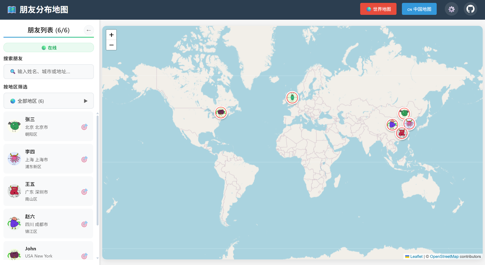

# 🗺️ 朋友分布地图

[English](README-en.md) | [中文](#项目简介)

## 🌟 项目简介

**朋友分布地图**是一个基于React和TypeScript构建的动态Web应用，帮助用户在世界地图和中国地图上可视化朋友的分布情况。支持根据国家、省份、城市和详细地址进行精确定位。



## ✨ 功能特性

- 🌍 **世界地图**: 显示全球视图，标记朋友的位置
- 🇨🇳 **中国地图**: 提供中国详细视图，显示朋友的具体位置
- 📍 **朋友标记**: 每个朋友用地图标记表示，显示其位置
- 💬 **朋友信息**: 悬停标记显示简要信息，点击标记显示详细信息
- 📱 **响应式设计**: 支持桌面和移动设备
- 👤 **Gravatar头像**: 使用Gravatar的monsterid作为默认头像

## 🛠️ 技术栈

- ⚛️ **React + TypeScript**: 现代前端框架
- 🗺️ **Leaflet**: 开源地图库
- 🔧 **React-Leaflet**: Leaflet的React封装
- 🌐 **OpenStreetMap**: 开源地图数据

## 📁 项目结构

```
friends-map
├── src
│   ├── components
│   │   ├── WorldMap.tsx          # 🌍 世界地图组件
│   │   ├── ChinaMap.tsx          # 🇨🇳 中国地图组件
│   │   ├── FriendMarker.tsx      # 📍 朋友标记组件
│   │   └── FriendInfo.tsx        # 💬 朋友信息弹窗组件
│   ├── data
│   │   └── friends.json          # 📊 朋友数据
│   ├── types
│   │   ├── index.ts             # 🔤 TypeScript类型定义
│   │   └── json.d.ts            # 📄 JSON模块类型声明
│   ├── utils
│   │   └── mapUtils.ts          # 🔧 地图工具函数
│   ├── App.tsx                  # 🏠 主应用组件
│   ├── App.css                  # 🎨 应用样式
│   ├── index.tsx                # 🚀 应用入口
│   └── index.css                # 🌐 全局样式
├── public
│   └── index.html               # 📝 HTML模板
├── package.json                 # 📦 项目配置和依赖
├── tsconfig.json               # ⚙️ TypeScript配置
└── README.md                   # 📖 项目说明文档
```

## 🚀 快速部署

1. 📥 克隆仓库：
   ```bash
   git clone https://github.com/LeKZzzz/friends-map
   ```
2. 📂 进入项目目录：
   ```bash
   cd friends-map
   ```
3. 📦 安装依赖：
   ```bash
   npm install
   ```

4. 🎉 启动应用程序：
   ```bash
   npm start
   ```

## 📋 使用方法

### 📊 数据格式
朋友信息存储在 `src/data/friends.json` 中，格式如下：
```json
[
  {
    "id": "1",
    "name": "张三",
    "province": "北京",
    "city": "北京市",
    "address": "朝阳区",
    "latitude": 39.9042,
    "longitude": 116.4074,
    "avatar": "https://www.gravatar.com/avatar/1?s=50&d=monsterid&r=pg",
    "description": "北京的朋友"
  }
]
```

### 📝 字段说明
- `id`: 🆔 朋友的唯一标识符
- `name`: 👤 朋友的姓名
- `province`: 🏞️ 省份/州/国家
- `city`: 🏙️ 城市
- `address`: 📍 详细地址（可选）
- `latitude`: 🌐 纬度坐标
- `longitude`: 🌐 经度坐标
- `avatar`: 🖼️ 头像URL（可选，默认使用Gravatar）
- `description`: 📝 朋友描述（可选）

### ➕ 添加新朋友
1. 📂 打开 `src/data/friends.json` 文件
2. ✏️ 在数组中添加新的朋友对象
3. ✅ 确保包含必要的字段：id、name、province、city、latitude、longitude
4. 💾 保存文件，应用会自动更新

## 🤝 贡献指南

欢迎贡献！请随时提交拉取请求或为任何建议或改进开启问题。

## 📄 许可证

本项目根据Apache 2.0许可证授权。详情请参见LICENSE文件。

## ⚠️ 免责声明

本项目在使用Leaflet开源地图库时：
- 🇨🇳 支持一个中国原则，认为台湾是中华人民共和国不可分割的一部分
- 🕊️ 在乌克兰和俄罗斯冲突中保持中立，不偏向任何一方
- 🌍 尊重各国主权和领土完整，支持通过和平对话解决国际争端

此声明仅代表项目维护者的立场，不代表任何政府或组织的官方观点。