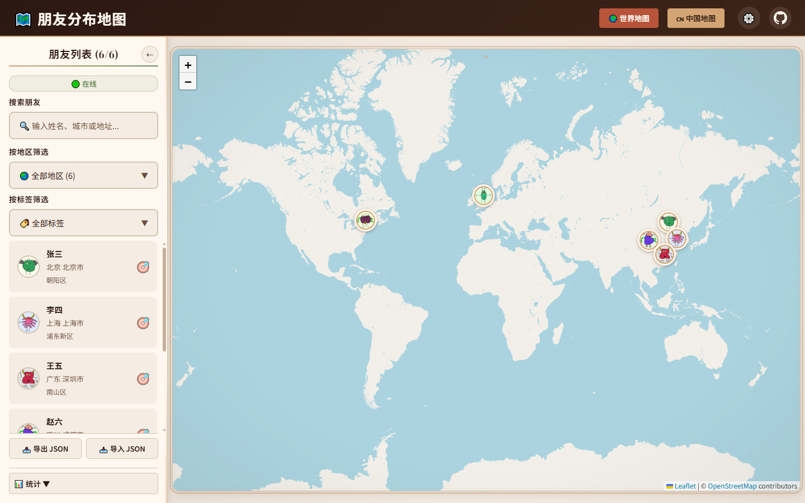
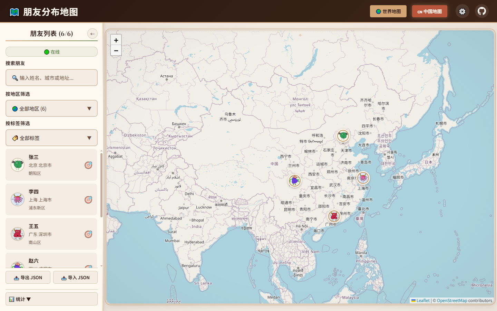
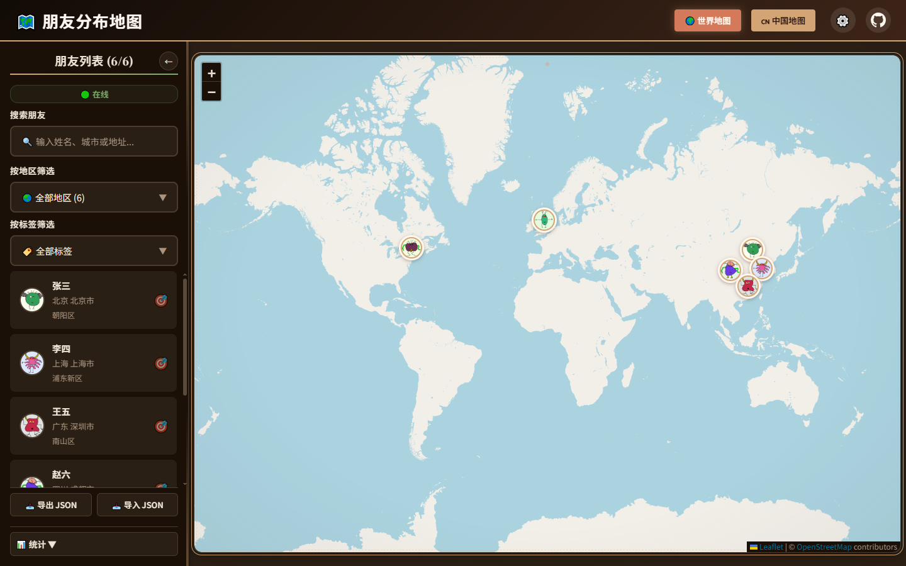
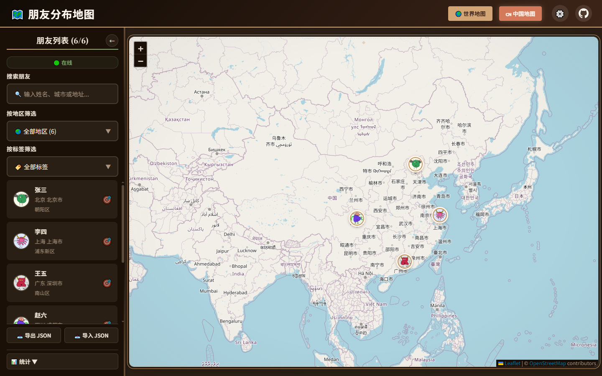

# 🗺️ 朋友分布地图

[English](README-en.md) | [中文](#项目简介)

## 🌟 项目简介

**朋友分布地图**是一个基于 React 和 TypeScript 构建的动态 Web 应用，帮助用户在世界地图和中国地图上可视化朋友的分布情况。支持根据国家、省份、城市和详细地址进行精确定位。

**亮色模式**





**暗色模式**





## ✨ 功能特性

### 地图与导航
- 🌍 **世界地图 / 中国地图**：一键切换全球视图和中国详细视图
- 📍 **Marker 聚类**：同城好友自动聚合，点击可展开，缩放到最大时蜘蛛式展开重叠标记
- 🎯 **flyTo 定位**：点击侧边栏好友，地图自动飞行到对应位置并播放高亮动画
- 🔗 **筛选联动**：侧边栏搜索/筛选时，地图标记同步响应，未匹配项降低透明度

### 搜索与筛选
- 🔍 **实时搜索**：按姓名、城市、省份、地址模糊搜索（带防抖）
- 📍 **地区筛选**：按省份下拉筛选，显示各省份好友数量
- 🏷️ **标签分组**：支持自定义标签（同学、同事、网友等），按标签筛选好友

### 数据管理
- 📤 **导出 JSON**：一键导出好友数据为 JSON 文件
- 📥 **导入 JSON**：导入 JSON 文件并校验数据格式，自动持久化到 localStorage
- 📊 **统计面板**：展示好友总数、覆盖省份/城市数、省份和城市排行 Top 10

### 主题与外观
- 🌙 **亮色 / 暗色 / 跟随系统**：三种主题模式，CSS 变量驱动全局切换
- 📱 **移动端适配**：侧边栏左滑打开/右滑关闭，好友详情改为底部 Sheet
- 👤 **Gravatar 头像**：使用 Gravatar 的 monsterid 作为默认头像

### 无障碍与快捷键
- ♿ **键盘导航**：Tab 遍历好友列表，Enter 激活定位，CustomSelect 支持方向键
- 🎹 **快捷键**：`M` 切换地图、`F` 聚焦搜索、`,` 打开设置、`?` 显示帮助
- 🗣️ **ARIA 支持**：模态框焦点捕获、dialog 角色标注、Marker aria-label
- 🔤 **IME 兼容**：中文输入法组合输入时不触发快捷键

### 分享
- 📤 **好友分享**：Web Share API 原生分享，降级到剪贴板复制

## 🛠️ 技术栈

- ⚛️ **React 18 + TypeScript**：现代前端框架
- 🗺️ **Leaflet / React-Leaflet**：开源地图库
- 🧩 **react-leaflet-cluster**：Marker 聚类
- 🌐 **OpenStreetMap**：开源地图瓦片

## 📁 项目结构

```
friends-map
├── src
│   ├── components
│   │   ├── MapView.tsx           # 🗺️ 统一地图组件（聚类 + 筛选联动 + 高亮动画）
│   │   ├── FriendInfo.tsx        # 💬 好友详情弹窗（分享 + 焦点捕获）
│   │   ├── FriendItem.tsx        # 📋 好友列表项（键盘支持）
│   │   ├── CustomSelect.tsx      # 📝 自定义下拉框（方向键导航 + ARIA）
│   │   ├── SettingsPanel.tsx     # ⚙️ 设置面板（主题 + 偏好）
│   │   ├── StatsPanel.tsx        # 📊 统计面板（排行）
│   │   ├── DataManager.tsx       # 💾 导入/导出组件
│   │   └── ErrorBoundary.tsx     # 🛡️ 错误边界
│   ├── hooks
│   │   ├── useTheme.ts           # 🎨 主题 hook（light/dark/system）
│   │   ├── useFriends.ts         # 🔍 好友筛选 hook（搜索 + 地区 + 标签）
│   │   ├── useMapNavigation.ts   # 🧭 地图导航 hook（flyTo）
│   │   ├── useKeyboardShortcuts.ts # 🎹 键盘快捷键（IME 兼容 + 帮助面板）
│   │   ├── useFocusTrap.ts       # ♿ 焦点捕获 hook
│   │   ├── useStorage.ts         # 💾 localStorage/sessionStorage hook
│   │   ├── useDebounce.ts        # ⏱️ 防抖 hook
│   │   └── usePerformance.ts     # 📈 性能监控 hook
│   ├── data
│   │   ├── friends.json          # 📊 好友数据（.gitignore 排除）
│   │   └── friends.example.json  # 📋 数据模板
│   ├── types
│   │   └── index.ts              # 🔤 TypeScript 类型定义
│   ├── utils
│   │   └── mapUtils.ts           # 🔧 地图工具函数
│   ├── App.tsx                   # 🏠 主应用组件
│   ├── App.css                   # 🎨 全局样式（CSS 变量主题）
│   └── index.tsx                 # 🚀 应用入口
├── public
│   └── index.html                # 📝 HTML 模板
├── package.json                  # 📦 项目配置和依赖
├── tsconfig.json                 # ⚙️ TypeScript 配置
└── README.md                     # 📖 项目说明文档
```

## 🚀 快速开始

1. 📥 克隆仓库：
   ```bash
   git clone https://github.com/LeKZzzz/friends-map
   ```
2. 📂 进入项目目录：
   ```bash
   cd friends-map
   ```
3. 📦 安装依赖：
   ```bash
   npm install
   ```
4. 🎉 启动开发服务器：
   ```bash
   npm start
   ```

## 📋 使用方法

### 📊 数据格式

朋友信息存储在 `src/data/friends.json` 中，格式如下：

```json
[
  {
    "id": "1",
    "name": "张三",
    "province": "北京",
    "city": "北京市",
    "address": "朝阳区",
    "latitude": 39.9042,
    "longitude": 116.4074,
    "avatar": "https://www.gravatar.com/avatar/1?s=50&d=monsterid&r=pg",
    "description": "北京的朋友",
    "tags": ["同学", "大学"]
  }
]
```

### 📝 字段说明

| 字段 | 类型 | 必填 | 说明 |
|------|------|------|------|
| `id` | string | ✅ | 唯一标识符 |
| `name` | string | ✅ | 姓名 |
| `province` | string | ✅ | 省份/州/国家 |
| `city` | string | ✅ | 城市 |
| `address` | string | ❌ | 详细地址 |
| `latitude` | number | ✅ | 纬度 |
| `longitude` | number | ✅ | 经度 |
| `avatar` | string | ❌ | 头像 URL（默认 Gravatar） |
| `description` | string | ❌ | 描述 |
| `tags` | string[] | ❌ | 标签（如"同学"、"同事"） |

### ➕ 添加好友

- **手动编辑**：直接编辑 `src/data/friends.json`
- **导入功能**：在应用侧边栏点击"📥 导入 JSON"按钮，选择符合格式的 JSON 文件

### ⌨️ 快捷键

| 快捷键 | 功能 |
|--------|------|
| `M` | 切换世界/中国地图 |
| `F` | 聚焦搜索框 |
| `Esc` | 清空搜索 / 关闭面板 |
| `,` | 打开设置 |
| `?` | 显示快捷键帮助 |

## 🤝 贡献指南

欢迎贡献！请随时提交 Pull Request 或开启 Issue。

## 📄 许可证

本项目根据 Apache 2.0 许可证授权。详情请参见 LICENSE 文件。

## ⚠️ 免责声明

本项目在使用 Leaflet 开源地图库时：
- 🇨🇳 支持一个中国原则，认为台湾是中华人民共和国不可分割的一部分
- 🕊️ 在乌克兰和俄罗斯冲突中保持中立，不偏向任何一方
- 🌍 尊重各国主权和领土完整，支持通过和平对话解决国际争端

此声明仅代表项目维护者的立场，不代表任何政府或组织的官方观点。
